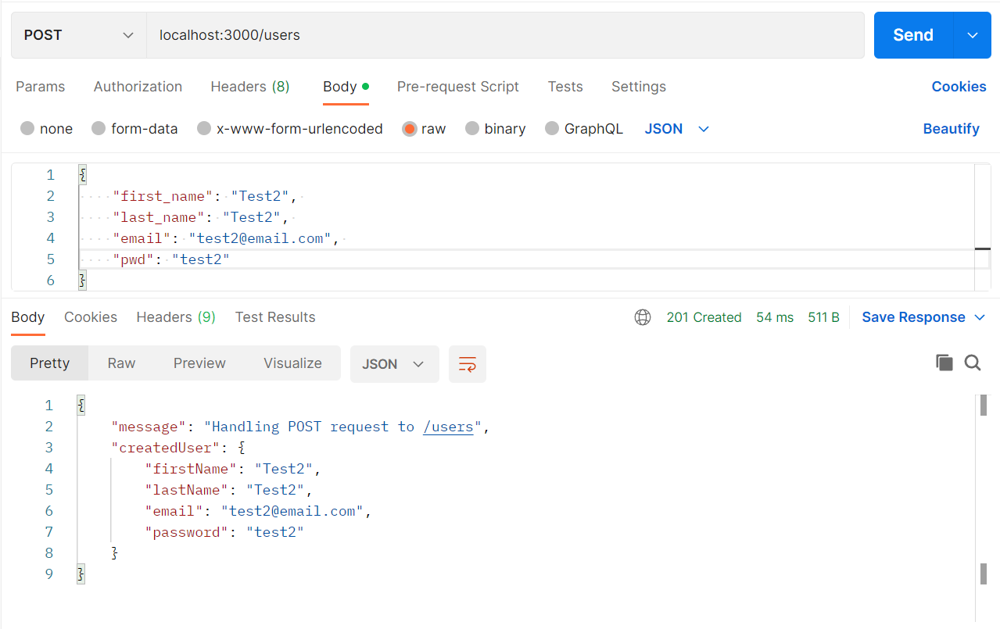
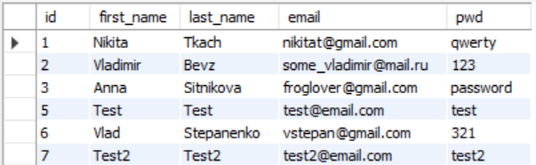
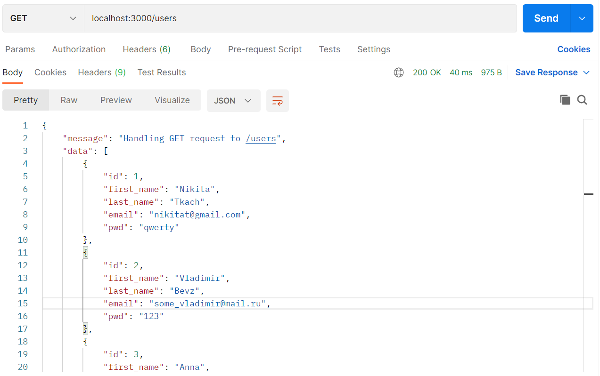
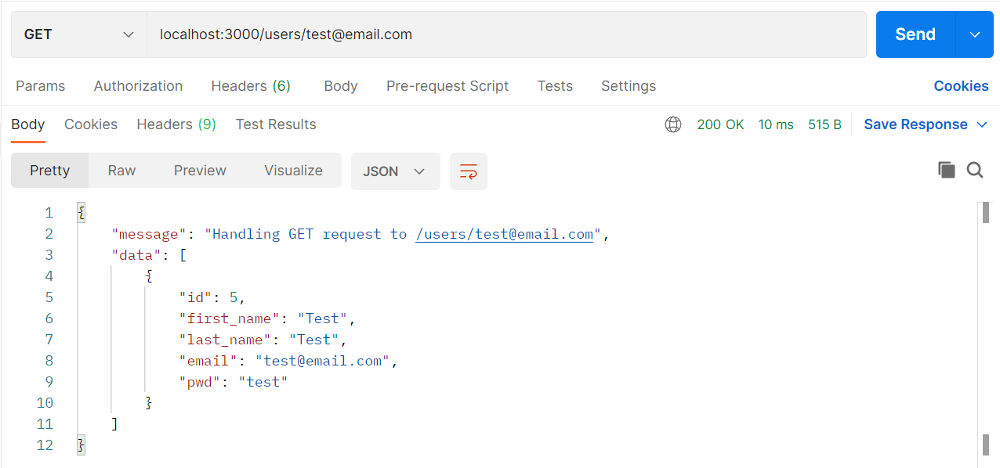
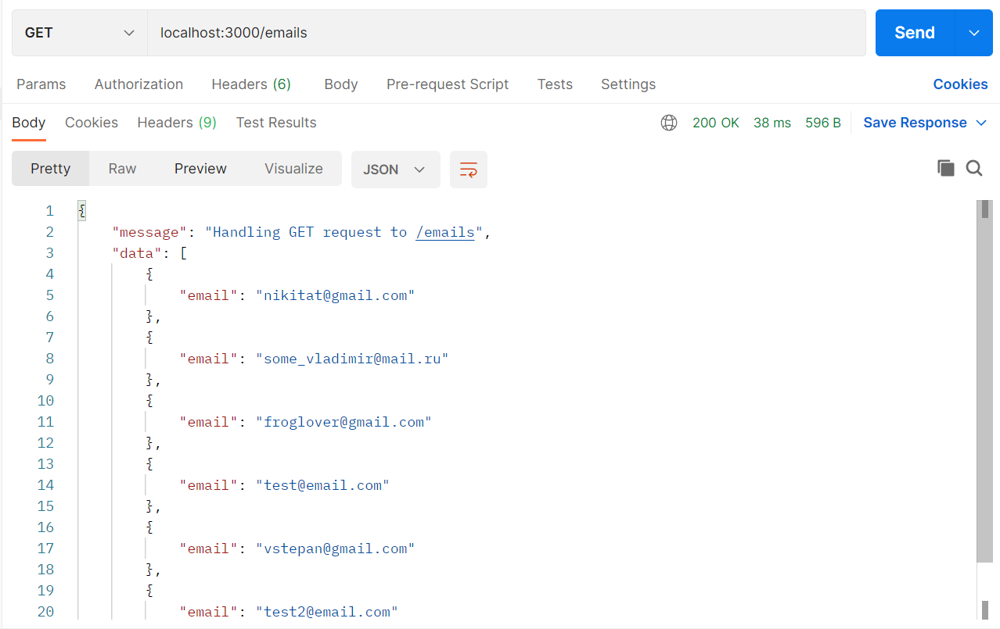

<h2>Testing REST API using Postman:</h2>
<ol>
  <h4><li>POST request to add a new user</li></h4>
  Postman:
   
  
   
  MySQL Database:
   
  
  
  <h4><li>GET request to get data on all users</li></h4>
  
  
  <h4><li>GET request to get user with special email</li></h4>
  
  
  <h4><li>GET request to get emails of all users</li></h4>
  
  
</ol>
